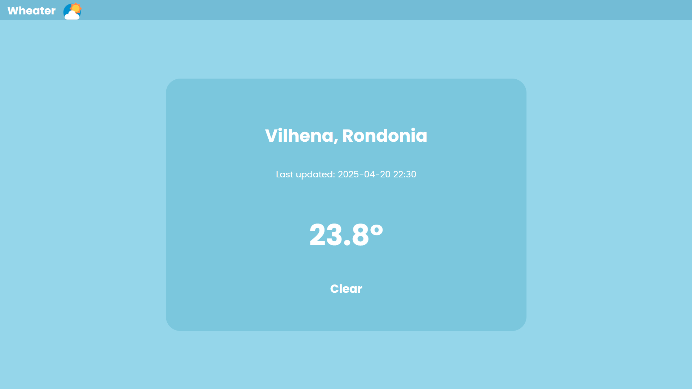

<a id="top"></a>
# Weather

<p align="center">
  
</p>

🇧🇷 Este projeto é uma aplicação de clima que busca dados meteorológicos em tempo real para Vilhena, Rondônia, utilizando a WeatherAPI. A aplicação exibe a temperatura atual, condição climática e o horário da última atualização.

---

## Tecnologias Utilizadas
- **HTML/CSS**: Para estruturação e estilização da interface.
- **JavaScript**: Para manipulação do DOM e integração com a API.
- **WeatherAPI**: API utilizada para obter os dados meteorológicos em tempo real.

## Funcionalidades Principais
- **Exibição de Dados Meteorológicos**: Mostra a temperatura atual, condição climática e horário da última atualização.
- **Atualização Automática**: Os dados são buscados automaticamente ao carregar a página.
- **Design Responsivo**: Interface adaptada para diferentes tamanhos de tela.

## Objetivos do Projeto
- **Aprender Consumo de APIs**: Implementar a integração com uma API externa para obter dados em tempo real.
- **Desenvolver Interface de Usuário**: Criar uma interface simples e funcional para exibir informações meteorológicas.
- **Praticar JavaScript**: Aplicar conceitos de manipulação do DOM e promessas.

## Como Executar
1. Clone o repositório:
   ```bash
   git clone https://github.com/EduardoTartas/vilhena-weather.git
